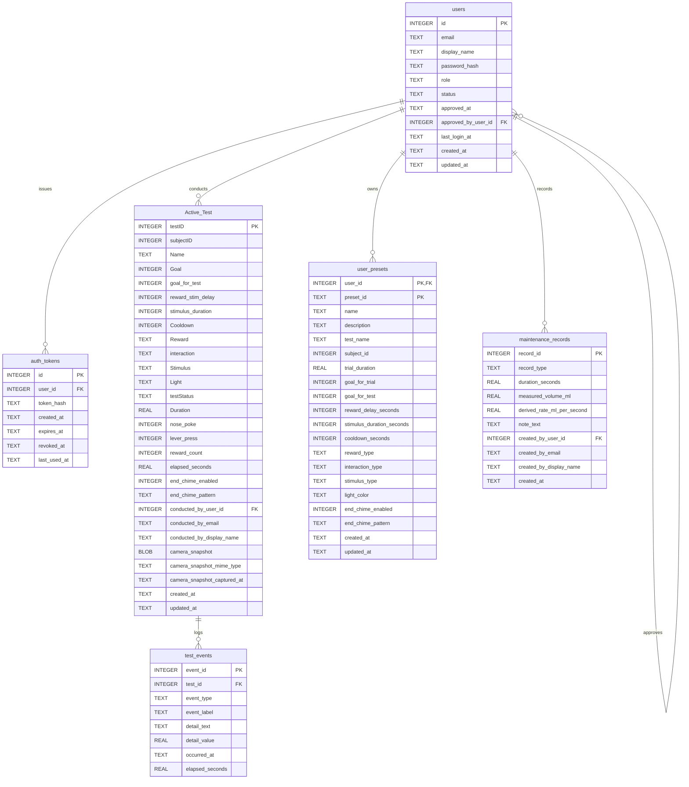

# Database ERD

This diagram shows the main SQLite tables used by SkinnerBox for auth, trial runtime/history, presets, and maintenance settings.

Notes:
- `Active_Test` is the project's historical name for the main trial/results table. It stores both the currently configured run and completed runs.
- `maintenance_records.record_type` distinguishes saved pump calibration, reward pulse, lever debounce, lever release requirement, and trial buzzer output records.
- `user_presets` uses a composite primary key of `user_id + preset_id`.

