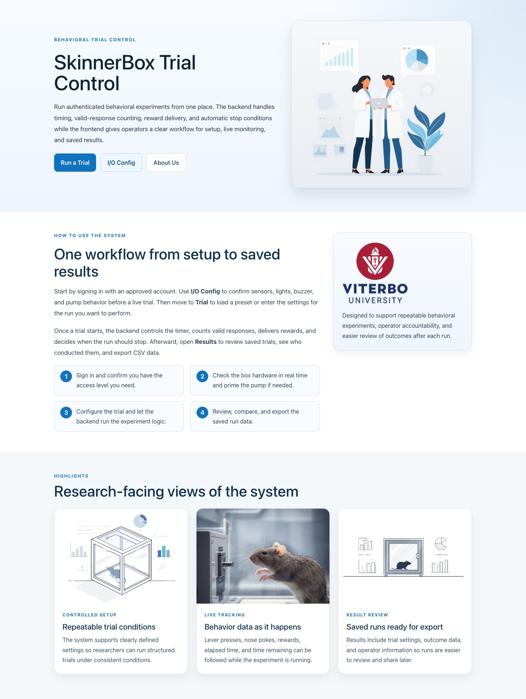
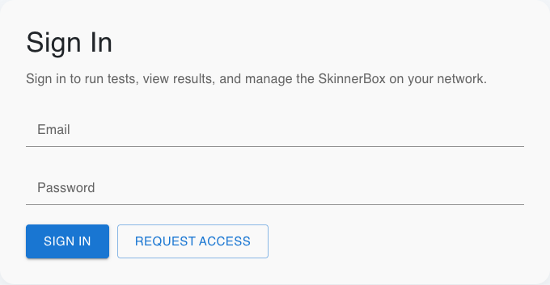
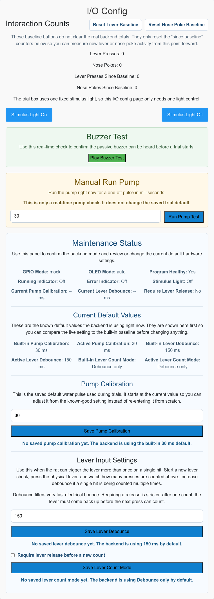
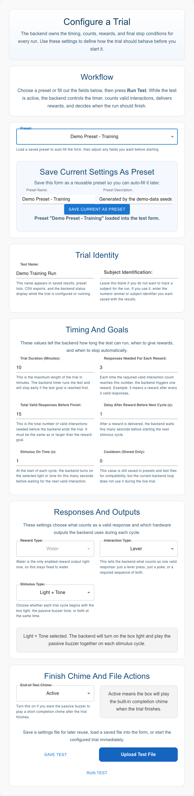
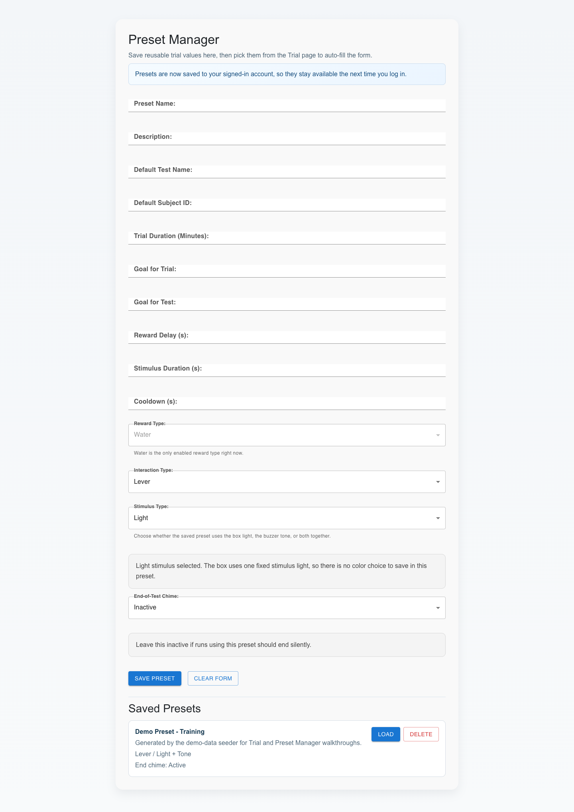
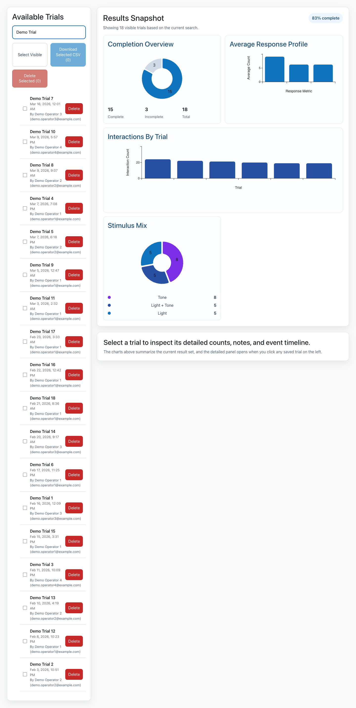
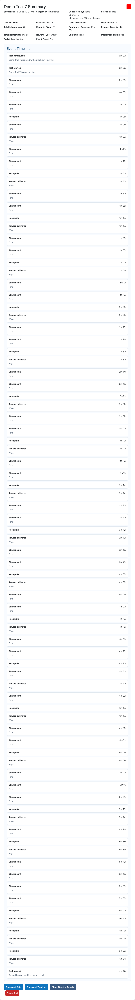
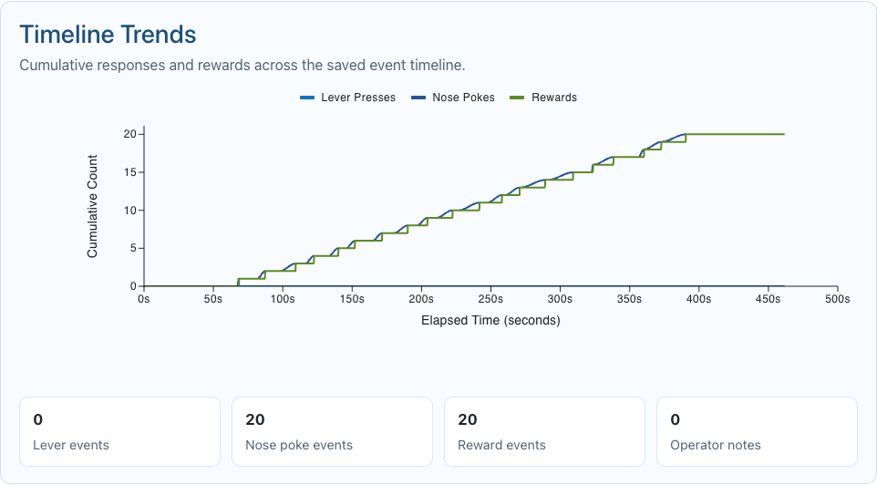
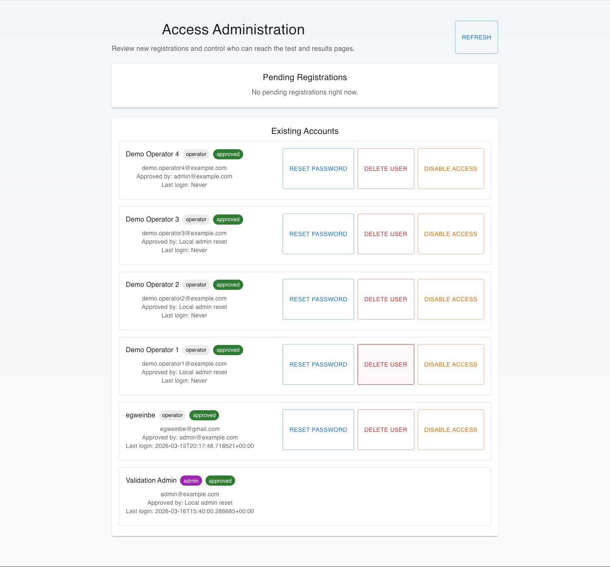

# SkinnerBox User Guide

## What This Program Does

SkinnerBox is used to run behavioral trials from a web interface. After a user signs in, they can:

-   check hardware behavior in real time
-   configure and run a trial
-   save and reuse presets
-   review completed trials
-   export result data

The system is designed so that the backend controls the actual experiment timing, counting, reward delivery, and stop conditions. The web interface is where users set up, monitor, and review those runs.

## Normal Workflow

Most users will use the program in this order:

1.  Sign in with an approved account.
2.  Open `I/O Config` to confirm the lever, nose poke, pump, light, and buzzer behave correctly.
3.  Open `Run a Trial` and load a preset or enter trial values manually.
4.  Start the trial and watch the live status during the run.
5.  If that box has an optional USB camera, turn on the live preview when you want a quick visual check during the run.
6.  Open `Results` to review the saved session, compare runs, export data, and view any attached camera snapshot.

## Signing In

Use the sign-in page to access the protected parts of the system.

### How To Sign In

1.  Open the login page.
2.  Enter your approved email and password.
3.  Select `Sign In`.

If your account has not been approved yet, you will not be able to use the protected pages until an administrator approves access.

### What To Expect

-   Approved users can open the trial, results, preset, and I/O pages.
-   Administrators can also open the Admin page.

### Common Problems

-   Wrong password
-   Account still waiting for approval
-   Backend not reachable

## Administrator Workflow

Some actions in the system can only be handled by an administrator. This matters because a normal user may need admin help before they can use the system fully.

Administrators are responsible for:

-   approving newly registered users
-   resetting passwords for users who cannot sign in
-   disabling access when a user should no longer use the system
-   deleting non-admin accounts when permanent removal is needed
-   deleting saved trials from `Results` when cleanup is required

### Typical Admin Workflow

1.  Sign in with an administrator account.
2.  Open the `Admin` page.
3.  Review any pending users and approve the people who should be allowed into the system.
4.  Help users who forgot their password by using `Reset Password`.
5.  Disable or delete user access if a person should no longer use the system.
6.  Open `Results` as an admin if saved trial cleanup is needed.

### What Non-Admin Users Need To Know

If you are not an administrator, you may need admin help when:

-   your account is still pending
-   you forgot your password
-   you need a user account changed or removed
-   saved trial data needs to be deleted

## Home Page

The Home page is the landing page for the app. It explains the purpose of the system and gives users a clear place to start.

Use it to:

-   understand the overall workflow
-   move to the main pages of the system
-   quickly reach `I/O Config`, `Run a Trial`, `Results`, or `About Us`

## I/O Config

`I/O Config` is the page used to check and adjust live hardware behavior before a trial starts.

Use this page when you want to:

-   confirm that lever presses are being counted
-   confirm that nose pokes are being counted
-   manually run the pump
-   test the stimulus light
-   play the buzzer test
-   review or change the current pump calibration value
-   review or change the lever debounce value
-   decide whether the lever must be released before another count can happen

### Interaction Counts

The counts section shows the current total lever presses and nose pokes seen by the backend.

It also shows:

-   `Lever Presses Since Baseline`
-   `Nose Pokes Since Baseline`

These `since baseline` values are only local measuring helpers for the page. They do not erase the real backend totals.

### Reset Lever Baseline

Use this when you want to start measuring fresh lever activity from the current moment.

This is useful when:

-   you are testing the lever after making an adjustment
-   you want to see whether one physical hit is being counted once or more than once

### Reset Nose Poke Baseline

Use this when you want to start measuring fresh nose-poke activity from the current moment.

This is useful when:

-   you are checking whether the nose-poke sensor is triggering consistently
-   you want to compare activity before and after a sensor adjustment

### Manual Run Pump

Use this to run the pump immediately for a one-time pulse in milliseconds.

This is for live checking only. It does not change the saved default used during trials.

### Pump Calibration

This is the saved default pump pulse used for water reward delivery during trials.

Use this section when:

-   the water reward pulse needs to be increased or decreased
-   you want to confirm the current default value being used by the system

### Lever Debounce

Debounce helps prevent one physical lever hit from being counted multiple times because of very fast switch bounce.

Increase this value if:

-   one hit is being counted more than once

Decrease it carefully only if:

-   valid hits are being missed

### Require Lever Release Before A New Count

Turn this on if a new lever count should only happen after the lever has been released.

This is stricter than debounce alone and is helpful when:

-   a held lever should not keep generating extra counts
-   you want a full press-and-release cycle before another valid press can be recorded

### Common Problems

-   Confusing total counts with `since baseline` counts
-   Expecting a baseline reset to erase backend totals
-   Forgetting to save a new default after testing a better value

## Run A Trial

`Run a Trial` is where the actual experiment is configured and started.

Use this page to:

-   load a preset
-   enter trial values manually
-   start a trial
-   pause, resume, stop, or finish a trial
-   watch the live trial state while it is running
-   optionally show a low-bandwidth camera preview on boxes with a USB camera

### Main Trial Fields

#### Test Name

This is the name that will appear later in Results. Use a clear name that helps identify the session.

#### Subject ID

This is optional. Use it if you want to associate the trial with a specific subject. Leave it blank if subject tracking is not being used.

#### Trial Duration

This is the total amount of time the trial is allowed to run.

#### Responses Needed For Each Reward

This is the number of valid responses needed before the system gives a reward for that cycle.

#### Total Valid Responses Before Finish

This is the overall response goal for the session. When the session reaches this amount, the test can complete.

#### Delay After Reward Before Next Cycle

This is the wait time after reward delivery before the next cycle begins.

#### Stimulus On Time

This is how long the selected stimulus stays active during each cycle.

#### Reward Type

Reward type is currently fixed to water.

#### Interaction Type

This determines what kind of interaction the trial is looking for, such as lever-only or mixed interaction patterns if those are configured in the system.

#### Stimulus Type

This controls whether the trial uses:

-   `Light`
-   `Tone`
-   `Light + Tone`

#### End Chime

This controls whether the end-of-test chime is active or inactive.

### Starting A Trial

1.  Open `Run a Trial`.
2.  Load a preset or fill in the form manually.
3.  Review the values carefully.
4.  Select `Run Test`.

### During A Trial

While the test runs, the page shows:

-   elapsed time
-   time remaining
-   current counts
-   reward information
-   trial state
-   an optional `Show Camera` control on boxes with a connected USB camera

The backend controls the timer and stop conditions. The page is showing backend state, not inventing its own copy of the timer.

### Optional Camera Preview

Some boxes may include a USB camera. When one is available, the Trial page can show a small still-image preview during the run.

Use this when:

-   you want a quick visual check during the session
-   you want lower network use than full video streaming

What to expect:

-   the preview is off by default
-   the image refreshes periodically instead of streaming full video
-   boxes without a camera will not show this control
-   camera problems should not stop the trial from running

### When The Trial Finishes

When the trial finishes:

-   the run is saved
-   the page can play the completion sound in the browser
-   the run becomes available in Results
-   if the optional camera was available, one small snapshot may be saved with the result

### Common Problems

-   Confusing `Responses Needed For Each Reward` with the total session goal
-   Starting a trial before checking the hardware in `I/O Config`
-   Expecting a manual pump test to be part of the trial start process

## Preset Manager

`Preset Manager` is used to save and reuse trial configurations.

Use it when:

-   you run similar trials often
-   you want to avoid re-entering the same settings every time
-   you want to update a commonly used trial setup

### How To Use It

1.  Open `Preset Manager`.
2.  Create a new preset or select one to edit.
3.  Save the preset.
4.  Open `Run a Trial` and load that preset into the trial form.

### What To Expect

-   Presets belong to the signed-in user.
-   A preset saved by one user is not automatically shared with every other account.

## Results

`Results` is where saved trials are reviewed after they finish.

Use it to:

-   search for saved trials
-   open one trial in detail
-   compare multiple trials
-   review operator notes
-   download summary CSV files
-   download event timeline CSV files
-   view an attached camera snapshot when one was saved with the trial

### Available Trials

The left side of the page lists saved trials. Each row shows:

-   trial name
-   saved date
-   operator

Users can search the list to find specific runs more quickly.

If a trial was saved on a box with the optional camera enabled, the detail panel may also include one attached still image from that run.

### Comparing Multiple Trials

Check multiple trials if you want the charts and comparison table to summarize a selected set of runs instead of just one.

This is useful when:

-   comparing different sessions for one subject
-   comparing different stimulus types
-   reviewing multiple runs from one day

### Download Data

Use `Download Data` to export the saved summary values for the currently selected trial.

Use `Download Selected CSV` to export multiple checked trials at once.

### Download Timeline

Use `Download Timeline` when the selected saved trial contains event timeline data.

Timeline data may include:

-   lever events
-   nose-poke events
-   reward events
-   operator notes
-   other saved session events

If no timeline was saved for a run, the page will tell you that there is nothing to download or chart.

### Attached Camera Snapshot

Some saved trials may include one small still image captured near the end of the run.

This is useful when:

-   you want a quick visual reference tied to the saved result
-   you want lightweight image evidence without storing full video

If a trial does not include a snapshot, no camera panel will appear in the detail view.

### Timeline Trends

Use `Show Timeline Trends` to see how activity accumulated during one saved run over time.

This view helps users spot patterns such as:

-   responses clustering early or late in a session
-   slow reward buildup
-   differences between lever and nose-poke activity across the trial

### Common Problems

-   Opening an older saved run that has no timeline data
-   Expecting delete actions to work when signed in as a non-admin user

## Understanding The Charts

The charts on the Results page are quick visual summaries of the current result set.

### Completion Overview

Shows how many of the selected or visible trials completed versus how many did not.

### Average Response Profile

Shows average response counts across the current result set.

### Interactions By Trial

Shows how active each trial was compared with the others.

### Stimulus Mix

Shows how many of the selected or visible runs used each stimulus mode.

### Timeline Trends

Shows how counts accumulated through time inside one selected saved run.

## Admin Page

The Admin page is only for administrator accounts.

Use it to:

-   approve new users
-   disable user access
-   reset a user password
-   delete a non-admin user account

### Admin-Only Actions

Only an administrator can:

-   approve a newly registered user so that person can sign in
-   reset another user's password
-   disable a user's access
-   permanently delete a non-admin user account
-   open the `Admin` page itself
-   delete saved trial data from the `Results` page

### When An Admin Is Needed

A regular user needs administrator help when:

-   their account is still pending approval
-   they forgot their password
-   they need an account disabled or removed
-   saved trial data needs to be deleted from the system

### What To Expect

-   Regular operators should not use this page.
-   Historical result snapshots remain even if a user account is later removed.
-   Approval, password reset, disable, and delete actions are administrator-only.

## Troubleshooting

### Cannot Sign In

-   Confirm the backend is running.
-   Confirm the frontend is pointed at the correct backend port.
-   Confirm the account has been approved.
-   Confirm the password is correct.

### Trial Will Not Start

-   Recheck the required trial fields.
-   Confirm the hardware is responding in `I/O Config`.
-   Look for an error message on the Trial page.

### Counts Are Not Changing

-   Use `I/O Config` to confirm the hardware is triggering.
-   Reset the lever or nose-poke baseline if you want to measure fresh activity from the current moment.
-   Recheck debounce and release settings if lever counts look wrong.

### Timeline Download Does Nothing

-   Open a result that actually has saved timeline events.
-   Check the event count shown in the selected trial details.

### Results Delete Fails

-   Make sure you are signed in as an administrator.

### Browser Completion Sound Does Not Play

-   Make sure the Trial page was open during the run.
-   Make sure the browser was allowed to play audio after user interaction.
